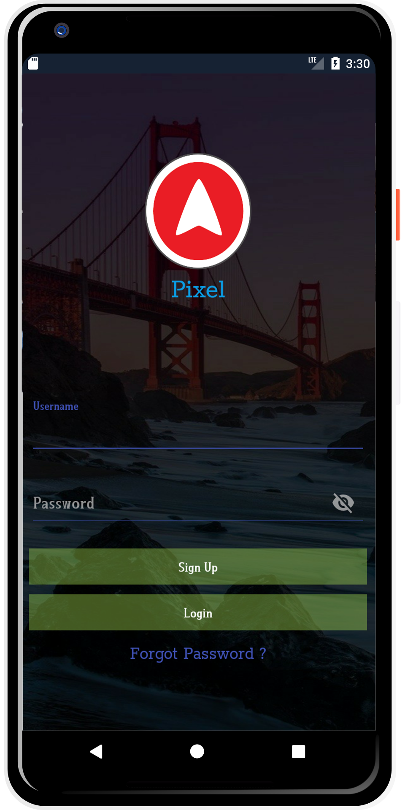
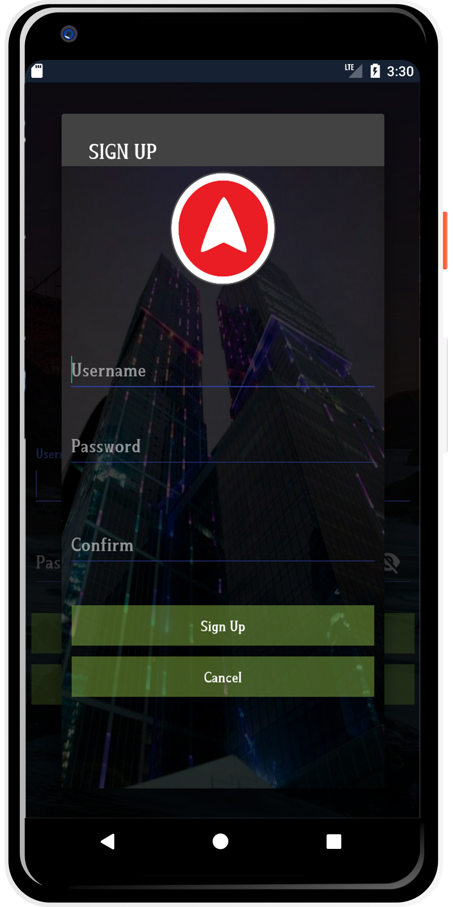
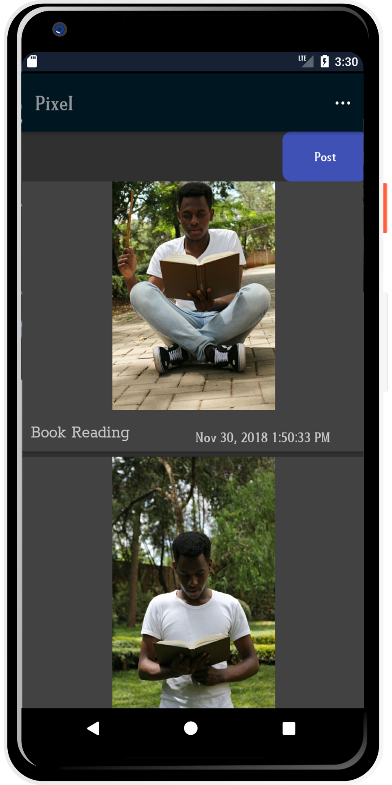
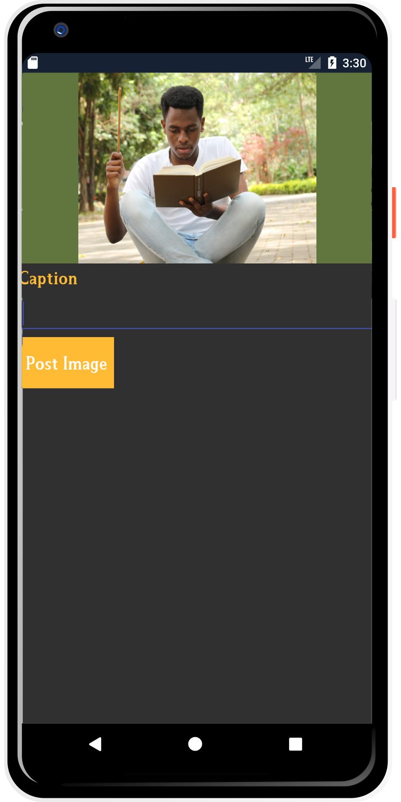
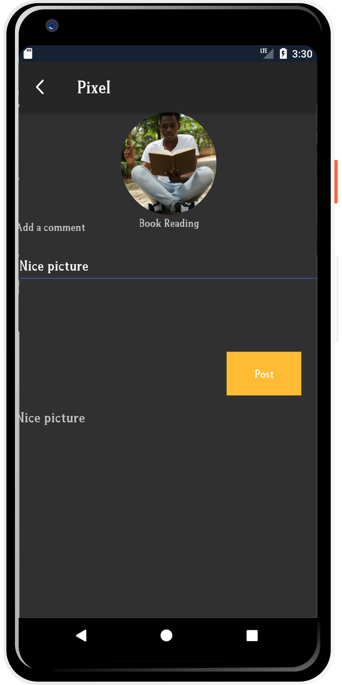

<p align="center">

<p>

# PIXEL :camera:


## DESCRIPTION.

**This is an Android photo uploading application that users can upload photos and get comments**.

## USER STORY.

- User can **Register** and ***create an account***.

- User can **Login** with the credentials used to ***sign up***.

- User can **upload photos**. 

- Users can **comment** on ***uploaded photos***.

<p align="center">

<p>

## PRE-REQUISITES.

**A couple of things to get you started:**

1. Ensure you have [Java](https://java.com/en/download/) installed

A simple way to install Java is using [sdkman](https://sdkman.io/).

Simply follow the instructions to have _sdkman_ installed and install java:

```bash
sdk install java
```

2. [Gradle](https://gradle.org/)

Gradle is used as the build tool and can be installed with sdkman:

```bash
sdk install gradle
```

3. [Android SDK](https://developer.android.com/studio/)

Android SDK used to provide all the necessary developer tools to build, test, and debug apps for Android in Windows, Mac or Linux.

4. [Android Build Tools](https://developer.android.com/studio/releases/build-tools)

Android SDK build tools used to debug, build, run and test an Android application.

## DISPLAY

#### Login & Register.

<p align="center">



<p>

#### Home Page, Post & Comment.

<p align="center">



<p>


## TECHNOLOGIES USED:

1. **[Adobe Photoshop](https://www.adobe.com/products/photoshop.html)**

***Photoshop*** is a **photo editing software**.

Used to **redesign and enhance images**

2. **[Java](https://java.com/en/download/)**

**source language.**

3. **[Gradle](https://gradle.org/)**

**For dependency management and running tasks.**

4. **[Android SDK](https://developer.android.com/studio/)**

**For providing all the necessary developer tools to build, test, and debug Android applications on Windows, Mac or Linux.**

5. **[Android Build Tools](https://developer.android.com/studio/releases/build-tools)**

**For debugging, building, running and testing an Android applications.**

6. **[Cloud Functions](https://firebase.google.com/docs/functions/)**

**Google Cloud Functions** is a **lightweight compute solution** for developers to ***create single-purpose, stand-alone functions that respond to Cloud events without the need to manage a server or runtime environment***.

7. **[Cloud Storage](https://firebase.google.com/docs/storage/)**

***Cloud Storage** is built for need to **store** and **serve** **large Data-sets** and user-generated content, ***such as*** **photos or videos**.

**Used in this Pixel to save images**

8. **[Realtime Database](https://firebase.google.com/docs/database/)**
***Realtime Database*** is an effective solution with a **low delay** for mobile applications. ***The database*** is **synced** with the ***client conditions*** in a **real time**.

9. **[TypeScript](https://firebase.google.com/docs/functions/typescript)**

**Cloud Functions only supports NodeJs, forcing you to use Javascript. Fortunately, we can mitigate some of the issues that Javascript brings with Typescript**.

**Cloud Functions provides two types of support:**

- ***Create and configure TypeScript projects for automatic transpilation at initialization*** **(firebase init functions)**.

- ***Transpile existing TypeScript source to JavaScript at deploy time via a predeploy hook***.

10. **[FireBase](https://firebase.google.com/)**

**Was used to authenticate users and register users and ensure user is logged in to run the application**

FireBase is a NoSQL **cloud database**. ***Data is synced across all clients in realtime, and remains available when your app goes offline. The Firebase Realtime Database is a cloud-hosted database. Data is stored as JSON and synchronized in realtime to every connected client***.

## **SETUP/INSTALLATION!**


1. You will need **Internet connection**.

2. You need to get into the **Pixel Android**.

Link:-> ```https://github.com/zecollokaris/Pixel-Android```

3. From there you can access **Pixel**.

4. **Clone** the project.

5. **get into project folder** (cd into project).

6. If you have all the **Pre-requisites**

7. Open your **Android Studio Editor and run the Application**.

## Support & Contact

- Mobile number: (+254) 798731203

- Email Address: collo.kariss@gmail.com

- github-username: [zecollokaris](https://github.com/zecollokaris)

## LICENSE

This project is licensed under the **MIT License** - see the [LICENSE](LICENSE) file for details.

